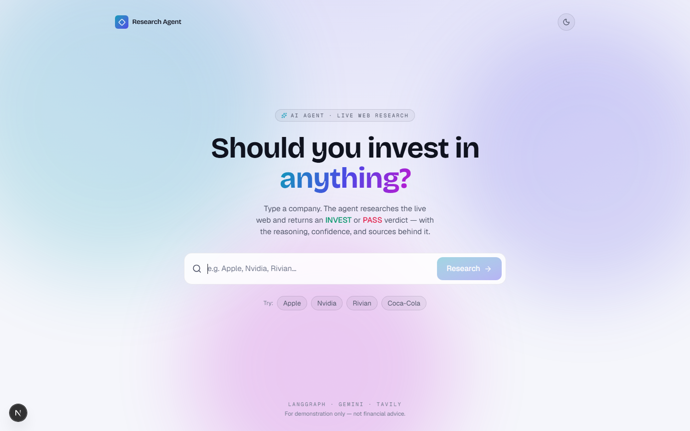
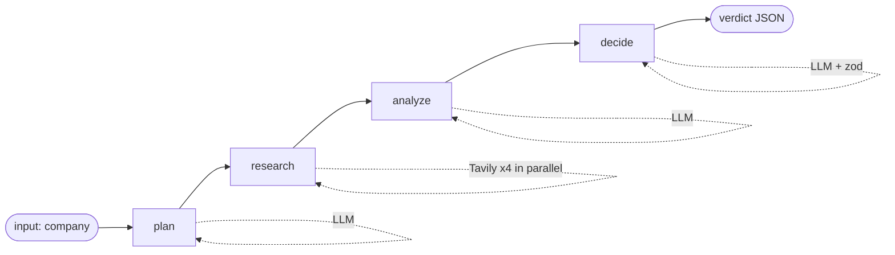
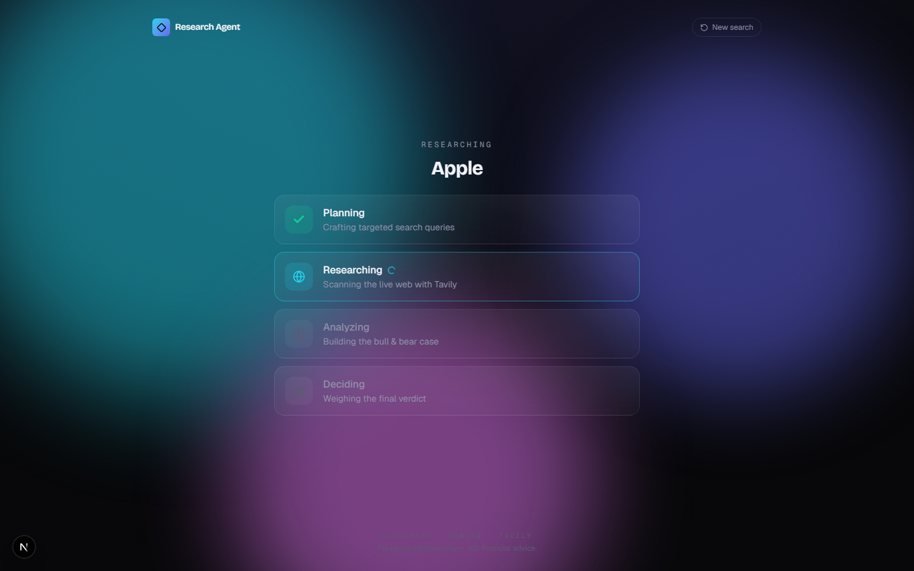
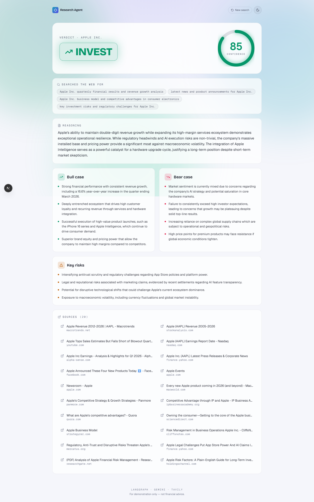

# 🧭 Investment Research Agent

> Type a company. An AI agent researches the **live web** and returns an **INVEST** or **PASS**
> verdict — with a confidence score, a bull case, a bear case, key risks, the reasoning, and the
> exact sources it used.

Built as a take-home for **InsideIIM × Altuni AI Labs**.

**🔗 Live demo: <https://investment-research-agent-rioi.onrender.com>**
_(Hosted on Render's free tier — the first request may take ~30–60s to wake from a cold start.)_



---

## Overview

The Investment Research Agent turns a single company name into a structured investment opinion.
Under the hood it's a small, explicit **LangGraph** agent that:

1. **Plans** — normalizes the company name and writes 3–4 targeted search queries.
2. **Researches** — runs those queries against the web (Tavily) in parallel and keeps the sources.
3. **Analyzes** — distills the research into a balanced **bull case**, **bear case**, and **key risks**.
4. **Decides** — weighs bull vs. bear and emits a strict, schema-validated verdict:
   `INVEST` / `PASS`, a `confidence` 0–100, and a short reasoning paragraph.

The whole thing is one **Next.js** app — the agent runs in a route handler, and the frontend is a
dark, animated single-page experience.

---

## How to run it

### Prerequisites

- **Node.js ≥ 20.9** (built and tested on 22.18)
- A **Google AI Studio (Gemini)** API key — free, no card: <https://aistudio.google.com/apikey>
- A **Tavily** API key — free tier, no card: <https://app.tavily.com>

### Setup

```bash
# 1. Install dependencies
npm install

# 2. Create your env file and paste in your two keys
cp .env.example .env        # then edit .env

# 3. Start the app
npm run dev                 # http://localhost:3000
```

### Environment variables

| Variable         | Required | Description                                                                          |
| ---------------- | -------- | ------------------------------------------------------------------------------------ |
| `GOOGLE_API_KEY` | ✅       | Gemini key from Google AI Studio.                                                    |
| `TAVILY_API_KEY` | ✅       | Tavily web-search key.                                                               |
| `LLM_PROVIDER`   | –        | `google` (default) or `openai`.                                                      |
| `LLM_MODEL`      | –        | Defaults to `gemini-2.0-flash`. The example runs below used `gemini-3.1-flash-lite`. |

> `.env` is gitignored; only `.env.example` (placeholders) is committed. **Never commit real keys.**

### Run the agent in the terminal (no UI)

The agent is fully usable from the command line — handy for testing and for seeing the node-by-node trace:

```bash
npm run agent -- "Apple"
```

---

## How it works

### Architecture

One Next.js (App Router) app does both jobs:

- **Frontend** (`app/`, `components/`) — the dark animated UI (React 19, Tailwind v4, Framer Motion).
- **Backend** (`app/api/research/route.ts`) — a Node route handler that runs the agent and returns JSON.
- **Agent** (`lib/agent/`) — the LangGraph state graph and its nodes.



### The 4 nodes

The agent is a `StateGraph` over a shared state of
`{ company, queries, findings, sources, analysis, decision }`.
Each node reads what it needs and writes back only its slice:

| Node       | Does                                                         | Writes                |
| ---------- | ----------------------------------------------------------- | --------------------- |
| `plan`     | LLM normalizes the name + generates 3–4 targeted queries    | `company`, `queries`  |
| `research` | Runs every query against Tavily in parallel, de-dupes URLs  | `findings`, `sources` |
| `analyze`  | LLM turns the research into bull / bear / risks             | `analysis`            |
| `decide`   | LLM weighs bull vs. bear → **strict zod-validated verdict** | `decision`            |

> The raw-research channel is named `findings` (not `research`) because LangGraph keeps node names
> and state channels in one namespace — a `research` node and a `research` channel would collide.

### Why zod?

The `decide` node uses `llm.withStructuredOutput(decisionSchema)`, so the model is forced to return
JSON matching a strict schema (`INVEST | PASS`, `confidence` 0–100, `reasoning`). The response is
validated before it ever reaches our code — no brittle string parsing.



---

## Key decisions & trade-offs

- **One Next.js app for frontend + backend.** No separate server. One repo, one deploy, one language.
  Matches the production stack and keeps the moving parts minimal.
- **LangGraph for the agent.** An explicit 4-node graph is easy to explain, gives typed shared state,
  and is trivial to extend (branching, retries, streaming) later — without the magic of a heavy
  "agent framework."
- **Tavily via a ~30-line `fetch` client — no SDK.** Tavily's REST endpoint is simple, so pulling in
  `@langchain/community` or an SDK would add weight with nothing to gain. Fewer dependencies to defend.
- **Gemini (`gemini-3.1-flash-lite`), provider-agnostic.** Free tier, fast, and reliable with
  structured output. `LLM_PROVIDER` / `LLM_MODEL` are env-driven, and the OpenAI path is one
  uncommented block + `npm i @langchain/openai` away.
- **Single POST, not SSE streaming.** The UI shows the real 4-node order while it waits. Live SSE
  streaming was intentionally left out: it adds a second code path and long-lived streams are flaky on
  free hosting (cold starts / buffering). A clean request/response is more robust for the demo.
- **Deliberately left out:** a structured **financial-data API** (the agent synthesizes from web search
  only, so figures are only as good as the sources), **auth/accounts**, **caching/persistence**, and
  **evals**. See below.

---

## Example runs (real output)

These are **real** verdicts from running the agent (`gemini-3.1-flash-lite` + Tavily), not mock-ups.
The agent clearly discriminates — confident INVESTs on durable franchises, PASSes on cash-burning
speculatives.

| Company         | Profile               | Verdict       | Confidence | Sources |
| --------------- | --------------------- | ------------- | ---------- | ------- |
| **Apple**       | Big tech              | 🟢 **INVEST** | 85         | 20      |
| **Coca-Cola**   | Profitable blue-chip  | 🟢 **INVEST** | 75         | 19      |
| **Rivian**      | Speculative EV maker  | 🔴 **PASS**   | 75         | 18      |
| **Beyond Meat** | Speculative food-tech | 🔴 **PASS**   | 85         | 20      |

<details>
<summary><strong>Apple → INVEST (85)</strong></summary>

> Apple's unparalleled ecosystem and brand loyalty provide a robust defensive moat that outweighs
> short-term concerns regarding incremental innovation… the strategic rollout of Apple Intelligence
> positions it well to capture long-term growth.

- **Bull:** 16.6% revenue growth in the most recent quarter; deep moat from switching costs + ecosystem.
- **Bear:** results beat but weren't a "blowout"; skepticism about incremental updates.
- **Risk:** margin compression from AI-component shortages; US–China geopolitical exposure.
- _Sources include CNBC's Q1-2026 earnings report, Macrotrends, and AlphaSense._

</details>

<details>
<summary><strong>Coca-Cola → INVEST (75)</strong></summary>

> Coca-Cola remains a quintessential defensive compounder with an unmatched global distribution moat
> and superior pricing power… a reliable anchor for a portfolio.

- **Bull:** 38.5% return on equity, 27.8% net margins; pricing power through inflation.
- **Bear:** soft demand for core carbonated drinks; rich valuation.
- **Risk:** sugar/health regulation; plastic & water sustainability pressure.
- _Sources include Coca-Cola Investor Relations (FY2025 results) and CNBC._

</details>

<details>
<summary><strong>Rivian → PASS (75)</strong></summary>

> Rivian remains in a precarious financial position characterized by significant cash burn and the
> ongoing need for external capital… the risk of dilution and operational failure outweighs the upside.

- **Bull:** strong brand in premium EV trucks; partnerships with Amazon, Volkswagen, Uber.
- **Bear:** persistent losses and cash burn; intense EV competition.
- **Risk:** needs more external financing; R2 ramp execution risk.
- _Sources include an SEC.gov filing, Macrotrends, and BusinessWire._

</details>

<details>
<summary><strong>Beyond Meat → PASS (85)</strong></summary>

> Beyond Meat faces a structural crisis characterized by declining consumer demand, persistent cash
> burn, and a balance sheet under significant pressure… a high-risk speculative play.

- **Bull:** product innovation (Beyond IV); push for positive EBITDA by late 2026.
- **Bear:** persistent losses + impairments; revenue missing expectations; stock far off IPO highs.
- **Risk:** further shareholder dilution; shifting consumer demand.
- _Sources include Beyond Meat Investor Relations (Q3-2025 results) and its 10-K._

</details>



---

## What I'd improve with more time

- **Add a structured financial-data API** (e.g. Financial Modeling Prep / Alpha Vantage) so verdicts
  rest on real fundamentals (revenue, margins, debt) instead of web-synthesized figures.
- **Real SSE streaming** of node progress for true live "watch it think" feedback.
- **Source quality ranking** — prefer filings/primary sources over blogs, and surface freshness.
- **Caching + history** so repeated lookups are instant and past verdicts are saved.
- **Evals** — a small benchmark set to track verdict quality + structured-output reliability across models.
- **Retries / rate-limit handling** around the LLM and Tavily calls.

---

## Tech stack

`Next.js 16` · `React 19` · `TypeScript` · `LangGraph.js` · `@langchain/google-genai` (Gemini) ·
`Tavily` (REST) · `zod` · `Tailwind CSS v4` · `Framer Motion` · `lucide-react`

## Project structure

```
app/
  api/research/route.ts   # POST { company } -> structured verdict JSON
  layout.tsx, page.tsx, globals.css
components/                # Aurora, ResearchApp, AgentSteps, VerdictBadge, ConfidenceGauge, ResultView
lib/
  agent/                   # schema, llm, tavily, state, nodes, graph
  types.ts                 # shared ResearchResult type
scripts/run-agent.ts       # standalone CLI runner
```

> ⚠️ For demonstration only — **not financial advice.**
